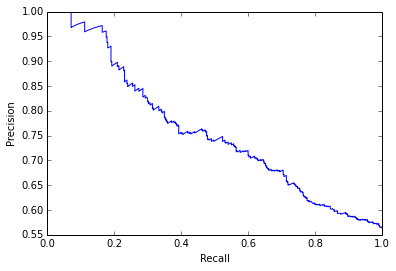
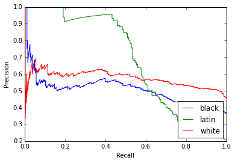
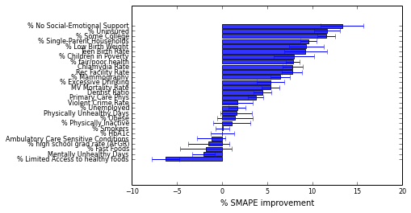
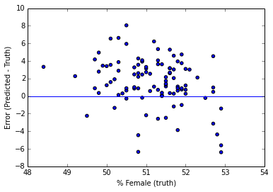
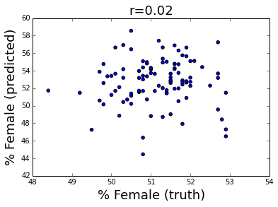

# Addressing selection bias in social media data for estimating county health
statistics

In [prior work](http://tapilab.github.io/public%20health/2014/04/26/twcounty/),
we estimated many county health statistics from Twitter activity.

In this work, we adjust for the sample bias of Twitter by reweighting data by
gender and race. We show improvements in held-out prediction accuracy using this
approach.

    # Classify users as male or female based on first names based on Census name frequency.
    from collections import defaultdict
    import re
    import requests
    
    def names2dict(url):
        """ Fetch data from census and parse into dict mapping name to frequency. """
        names = defaultdict(lambda: 0)
        for line in requests.get(url).text.split('\n'):
            parts = line.lower().split()
            if len(parts) >= 2:
                names[parts[0]] = float(parts[1])
        return names
    
    def getCensusNames():
        """ Fetch census name data and remove ambiguous names. """
        males = names2dict('http://www.census.gov/genealogy/www/data/1990surnames/dist.male.first')
        females = names2dict('http://www.census.gov/genealogy/www/data/1990surnames/dist.female.first')
        print len(set(males.keys() + females.keys())), 'total names'
        eps = 10.  # keep names that are eps times more frequent in one gender than the other.
        tokeep = []
        for name in set(males.keys() + females.keys()):
            mscore = males[name]
            fscore = females[name]
            if mscore == 0 or fscore == 0 or mscore / fscore > eps or fscore / mscore > eps:
                tokeep.append(name)
        print 'keeping', len(tokeep)
        m = set([n for n in tokeep if males[n] > females[n]])
        f = set([n for n in tokeep if females[n] > males[n]])
        return m, f
    
    males, females = getCensusNames()
    print 'found', len(males), 'males and', len(females), 'females'
    
    def labelGender(tweet, males, females):
        """ Classify a tweet as male (m) female (f) or neutral (n) based on first token in name field. """
        name = tweet['user']['name'].lower().split()
        if len(name) == 0:
            name = ['']
        name = re.findall('\w+', name[0])
        if len(name) == 0:
            name = ''
        else:
            name = name[0]
        if name in males:
            tweet['user']['gender'] = 'm'
        elif name in females:
            tweet['user']['gender'] = 'f'
        else:
            tweet['user']['gender'] = 'n'
        return tweet
    
    print 'John is', labelGender({'user':{'name':'John smith'}}, males, females)['user']['gender']
    print 'Jane is', labelGender({'user':{'name':'jane doe'}}, males, females)['user']['gender']
    print 'kris is', labelGender({'user':{'name':'Kris doe'}}, males, females)['user']['gender']

    5163 total names
    keeping 5008
    found 1048 males and 3960 females
    John is m
    Jane is f
    kris is n

    def labelRace(tweet):
        
        desc = tweet['user']['description']
        if not desc:
            desc = ''
        toks = set(re.findall('\w+', desc.lower()))
        
        if len(set(['african', 'black', 'aa', 'sbm', 'sbf']) & toks) > 0:
            tweet['user']['race'] = 'b'
            print 'black:', desc
        elif len(set(['latin', 'latino', 'latina', 'hispanic']) & toks) > 0:
            tweet['user']['race'] = 'l'
            print 'latino:', desc
        else:
            tweet['user']['race'] = 'n'
        return tweet
    
    print 'John is', labelRace({'user':{'description':'african-american'}})['user']['race']
    print 'Jane is', labelRace({'user':{'description':'black man'}})['user']['race']
    print 'kris is', labelRace({'user':{'description':'a latino'}})['user']['race']
    print 'foo is', labelRace({'user':{'description':'blah'}})['user']['race']

    John is black: african-american
    b
    Jane is black: black man
    b
    kris is latino: a latino
    l
    foo is n

    %pylab inline
    # Train a race classifier based on description field.
    import glob
    import io
    import json
    import os
    import re
    
    import numpy as np
    
    from sklearn.cross_validation import KFold
    from sklearn.feature_extraction.text import CountVectorizer, TfidfVectorizer
    from sklearn.linear_model import LogisticRegression
    from sklearn.metrics import classification_report, precision_recall_curve
    from sklearn.preprocessing import label_binarize, scale
    
    from twutil import preprocess
    
    def print_top_feats_cl(m, feature_names, labels, n=10):
        for i, coef in enumerate(m.coef_):
            srted = np.argsort(coef)
            topi = srted[::-1][:n]
            boti = srted[:n]
            print 'label=', labels[i]
            print 'pos:' + ' '.join('%s (%.2g)' % (n, c) for n, c in zip(feature_names[topi], coef[topi]))
            print 'neg:' + ' '.join('%s (%.2g)' % (n, c) for n, c in zip(feature_names[boti], coef[boti]))
    
    def prec_rec(truths_bin, probs, races):
        truths_bin = np.array(truths_bin)
        probs = np.array(probs)
        precision = dict()
        recall = dict()
        for i in range(len(races)):
            precision[i], recall[i], _ = precision_recall_curve(truths_bin[:, i],
                                                                probs[:, i])
            
        # Plot Precision-Recall curve for each class
        for i in range(len(races)):
            plot(recall[i], precision[i], label=races[i])
        xlabel('Recall')
        ylabel('Precision')
        legend(loc="lower right")
        
    def prec_rec_afro_hisp(truths_bin, probs, races):
        truths_bin = np.array(truths_bin)
        probs = np.array(probs)
        truths_ah = np.array(truths_bin[:, 0] + truths_bin[:, 1])
        probs_ah = np.array([max(i, j) for i, j in zip(probs[:, 0], probs[:, 1])])
        precision, recall, _ = precision_recall_curve(truths_ah,  probs_ah)
        plot(recall, precision)
        xlabel('Recall')
        ylabel('Precision')
        legend(loc="lower right")
        plt.savefig('race.pdf', bbox_inches='tight')
        
    def read_race_data(race_path, tzer, races):
        tokens = []
        labels = []
        for fname in glob.glob(race_path + '/*.*'):
            label = os.path.splitext(os.path.basename(fname))[0]
            for line in io.open(fname, encoding='utf8'):
                js = json.loads(line)
                toks = tzer.do_tokenize(js['description'])
                if len(toks) > 0:
                    labels.append(races.index(label))
                    tokens.append(' '.join(toks))
        return tokens, labels
    
    races = ['black', 'latin', 'white']
    
    def train_race_clf():
        print 'training race classifier'
        tzer = preprocess.Tokenizer(fields='description', retain_punc_toks=False, collapse_digits=True)
        tokens, labels = read_race_data('/data/twcounty/labeled_users/race', tzer, races)
        vec = TfidfVectorizer(token_pattern='\S+', min_df=2, binary=True)
        X = vec.fit_transform(tokens)    
        y = np.array(labels)
        print 'vocab size=', len(vec.get_feature_names())
    
        cv = KFold(len(y), 10, shuffle=True, random_state=123456)
        m = LogisticRegression(class_weight='auto')
        preds = []
        truths = []
        probs = [] 
        y_bin = label_binarize(y, classes=range(len(races)))
        truths_bin = []
        for train, test in cv:
            m.fit(X[train], y[train])
            preds.extend(m.predict(X[test]))
            truths.extend(y[test])
            probs.extend(m.predict_proba(X[test]))
            truths_bin.extend(y_bin[test])
            
        print classification_report(truths, preds, target_names=races)
        m.fit(X, y)
        m.tzer = tzer
        m.vec = vec
        print_top_feats_cl(m, np.array(vec.get_feature_names()), races, 5)
        # What is precision of classifications with probability > .5?
        threshold = 0.5
        y_filtered = [i for i, pred in enumerate(preds) if probs[i][pred] > threshold]
        print len(y_filtered), 'retained of', len(preds), 'total using threshold', threshold
        print classification_report(np.array(truths)[y_filtered], np.array(preds)[y_filtered], target_names=races)
        prec_rec_afro_hisp(truths_bin, probs, races)
        return m
        
        
    def label_race_clf(tweet, clf):
        desc = tweet['user']['description']
        if not desc:
            desc = ''
        preds = clf.predict_proba(clf.vec.transform([' '.join(clf.tzer.do_tokenize(desc))]))[0]
        if max(preds) > 0.5:
            # print 'predicting', races[np.argmax(preds)], 'for', tweet['user']['screen_name'], desc
            tweet['user']['race'] = races[np.argmax(preds)]
        else:
            tweet['user']['race'] = 'n'
        return tweet
    
    race_clf = train_race_clf()
    print 'John is', label_race_clf({'user':{'description':'r.i.p.', 'screen_name':'john'}}, race_clf)['user']['race']
    print 'Jane is', label_race_clf({'user':{'description':'que', 'screen_name':'jane'}}, race_clf)['user']['race']
    print 'Joe is', label_race_clf({'user':{'description':'like', 'screen_name':'joe'}}, race_clf)['user']['race']
    print 'Jesse is', label_race_clf({'user':{'description':'asdf', 'screen_name':'jesse'}}, race_clf)['user']['race']

    Populating the interactive namespace from numpy and matplotlib
    training race classifier
    vocab size= 766
                 precision    recall  f1-score   support
    
          black       0.53      0.47      0.50       263
          latin       0.81      0.51      0.62       157
          white       0.56      0.72      0.63       324
    
    avg / total       0.60      0.59      0.58       744
    
    label= black
    pos:for (1.5) r.i.p (1.3) money (1.2) live (1.2) team (1.1)
    neg:de (-1.4) y (-1.1) la (-0.89) like (-0.86) and (-0.81)
    label= latin
    pos:de (3.1) y (2.5) que (1.6) un (1.5) en (1.5)
    neg:for (-1.5) of (-1.3) the (-1.1) and (-1) you (-1)
    label= white
    pos:and (1.4) like (1.2) 9/9 (0.95) not (0.94) am (0.83)
    neg:de (-1.8) y (-1.3) live (-1) me (-1) instagram (-0.98)
    245 retained of 744 total using threshold 0.5
                 precision    recall  f1-score   support
    
          black       0.52      0.48      0.50        71
          latin       0.96      0.76      0.84        86
          white       0.60      0.76      0.67        88
    
    avg / total       0.70      0.68      0.68       245
    
    John is black
    Jane is latin
    Joe is white
    Jesse is n

    # Read in Twitter json files, classifying each by gender and/or race.
    from collections import Counter
    import io
    import glob
    import json
    import os
    import re
    import sys
    import tok.unicode_props
    
    import tweet
    import json2tsv
    
    JSON_D='/data/twcounty/json/'  # Directory containing one json file per county, named according to FIPS.
        
    def iter_jsons(f):
        """ Iterate tweet json objects from a file, appending county information from file name."""
        fp = io.open(f, mode='rt', encoding='utf8')
        county = os.path.basename(f)
        count = 0    
        for line in fp:
            try:
                line = re.sub('\t', '     ', line)
                js = json.loads(line)
                if json2tsv.valid_line(js):
                    js['county'] = county
                    yield js
                    count += 1
                    if count >= 10000:  # FIXME: limiting to first 1000 users per county for testing.
                        return
            except:
                pass
    
    def iter_files(path):
        """ Iterate tweets in directory of json files. """
        fcount = 1
        for fname in glob.glob(path + '/*'):
            print 'parsing', fname, '(#', fcount, ')'
            fcount += 1
            for js in iter_jsons(fname):
                yield js
    
    def iter_gender(jss):
        for js in jss:
            labelGender(js, males, females)
            yield js
    
    def iter_race(jss, race_clf):
        for js in jss:
            label_race_clf(js, race_clf)
            yield js
    
    def iter_tokenize(jss):
        all_users = set()
        for js in jss:
            if not js['user']['description']:
                js['user']['description'] = ' '
            tw = tweet.Tweet(js['county'], js['id'], js['user']['screen_name'],
                                json2tsv.tokenize(js['text'], tokenizer),
                                json2tsv.tokenize(js['user']['description'], tokenizer))
            tw.gender = js['user']['gender']
            tw.race = js['user']['race']
            if tw.screen_name not in all_users:
                county2gender[js['county']][tw.gender] += 1
                county2race[js['county']][tw.race] += 1
                all_users.add(tw.screen_name)
            gender_counts.update([tw.gender])
            race_counts.update([tw.race])
            yield tw

    def do_featurize(feats, words, prefix, alpha, unigrams=True, liwc=False, perma=False):
        lexi = tsv2feats.lexicons(words, liwc, perma)
        if unigrams:
            lexi.extend(words)
        for t in lexi:
            feats[alpha[prefix + t]] += 1
        return feats
    
    
    # def featurize(tw, alpha, unigrams, liwc, perma):
    #     feats = defaultdict(lambda: 0)
    #    if tw.text:
    #        do_featurize(feats, tw.text.split(' '), '', alpha, unigrams, liwc, perma)
    #        if tw.gender != 'n':
    #            do_featurize(feats, tw.text.split(' '), tw.gender + "_", alpha, unigrams, liwc, perma)
    #    if tw.description:
    #        do_featurize(feats, tw.description.split(' '), 'd=', alpha, unigrams, liwc, perma)
    #        if tw.gender != 'n':
    #            do_featurize(feats, tw.description.split(' '), tw.gender + '_d=', alpha, unigrams, liwc, perma)
    #    return feats
    
    def featurize(tw, alpha, unigrams, liwc, perma):
        """
        >>> alpha = defaultdict(lambda: len(alpha))
        >>> feats = featurize(tweet.Tweet('cty1', '123', 'joe', 'i', 'abject'), alpha, True, True, True)
        >>> all(feats[alpha[word]] == 1 for word in [u'd=P-', u'Pronoun', u'I', u'Self', 'i', 'd=abject'])
        True
        """
        feats = defaultdict(lambda: 0)
        if tw.text:
            toks = tw.text.split(' ')
            do_featurize(feats, toks, '', alpha, unigrams, liwc, perma)
            if tw.race != 'n':
                do_featurize(feats, toks, 'race=' + tw.race + "_", alpha, unigrams, liwc, perma)
            if tw.gender != 'n':
                do_featurize(feats, toks, 'gender=' + tw.gender + "_", alpha, unigrams, liwc, perma)
        if tw.description:
            toks = tw.description.split(' ')
            do_featurize(feats, toks, 'd=', alpha, unigrams, liwc, perma)
            if tw.gender != 'n':
                do_featurize(feats, toks, 'gender=' + tw.gender + '_d=', alpha, unigrams, liwc, perma)
            if tw.race != 'n':
                do_featurize(feats, toks, 'race=' + tw.race + '_d=', alpha, unigrams, liwc, perma)
        return feats
    
    def read_tweets(tweets, user_norm=False, unigrams=True, liwc=False, perma=False):
        alpha = defaultdict(lambda: len(alpha))
        # county -> tweets
        tweets_by_county = defaultdict(lambda: defaultdict(lambda: 0))
        users_by_county = defaultdict(lambda: set())
        tweets_by_user = defaultdict(lambda: defaultdict(lambda: set()))
        i = 0
        for tw in tweets:
            users_by_county[tw.county].add(tw.screen_name)
            feats = featurize(tw, alpha, unigrams, liwc, perma)
            for k, v in feats.iteritems():
                if user_norm:
                    if k not in tweets_by_user[tw.county][tw.screen_name]:
                        tweets_by_county[tw.county][k] += 1
                        tweets_by_user[tw.county][tw.screen_name].add(k)
                else:
                    tweets_by_county[tw.county][k] += v
            i += 1
        return tsv2feats.default_dict_to_dict(tweets_by_county), users_by_county, alpha

    # READ DATA
    # Parse all json files. This takes a while.
    import data
    import expt
    import tsv2feats
    
    tokenizer = tok.unicode_props.UP_Tiny(1)
    
    gender_counts = Counter()
    race_counts = Counter()
    county2race = defaultdict(lambda: {'black': 0., 'latin': 0., 'white':0., 'n': 0.})
    county2gender = defaultdict(lambda: {'m': 0., 'f': 0., 'n':0.})
    race_clf = train_race_clf()
    
    features_og, users_by_county_og, alpha_og = tsv2feats.read_tweets(iter_tokenize(iter_race(iter_gender(iter_files(JSON_D)), race_clf)),
                                                                                   user_norm=True, unigrams=False, liwc=True, perma=True)
    features_og_gender, users_by_county_og_gender, alpha_og_gender = read_tweets(iter_tokenize(iter_race(iter_gender(iter_files(JSON_D)), race_clf)), user_norm=True, unigrams=False, liwc=True, perma=True)
    print 'genders:', gender_counts
    print 'races:', race_counts

    training race classifier
                 precision    recall  f1-score   support
    
          black       0.53      0.47      0.50       263
          latin       0.81      0.51      0.62       157
          white       0.56      0.72      0.63       324
    
    avg / total       0.60      0.59      0.58       744
    
    label= black
    pos:for (1.5) r.i.p (1.3) money (1.2) live (1.2) team (1.1)
    neg:de (-1.4) y (-1.1) la (-0.89) like (-0.86) and (-0.81)
    label= latin
    pos:de (3.1) y (2.5) que (1.6) un (1.5) en (1.5)
    neg:for (-1.5) of (-1.3) the (-1.1) and (-1) you (-1)
    label= white
    pos:and (1.4) like (1.2) 9/9 (0.95) not (0.94) am (0.83)
    neg:de (-1.8) y (-1.3) live (-1) me (-1) instagram (-0.98)
    245 retained of 744 total using threshold 0.5
                 precision    recall  f1-score   support
    
          black       0.52      0.48      0.50        71
          latin       0.96      0.76      0.84        86
          white       0.60      0.76      0.67        88
    
    avg / total       0.70      0.68      0.68       245
    
    parsing /data/twcounty/json/01073 (# 1 )
    parsing /data/twcounty/json/04013 (# 2 )
    parsing /data/twcounty/json/04019 (# 3 )
    parsing /data/twcounty/json/06001 (# 4 )
    parsing /data/twcounty/json/06013 (# 5 )
    parsing /data/twcounty/json/06019 (# 6 )
    parsing /data/twcounty/json/06029 (# 7 )
    parsing /data/twcounty/json/06037 (# 8 )
    parsing /data/twcounty/json/06059 (# 9 )
    parsing /data/twcounty/json/06065 (# 10 )
    parsing /data/twcounty/json/06067 (# 11 )
    parsing /data/twcounty/json/06071 (# 12 )
    parsing /data/twcounty/json/06073 (# 13 )
    parsing /data/twcounty/json/06075 (# 14 )
    parsing /data/twcounty/json/06077 (# 15 )
    parsing /data/twcounty/json/06081 (# 16 )
    parsing /data/twcounty/json/06085 (# 17 )
    parsing /data/twcounty/json/06111 (# 18 )
    parsing /data/twcounty/json/08041 (# 19 )
    parsing /data/twcounty/json/09001 (# 20 )
    parsing /data/twcounty/json/09003 (# 21 )
    parsing /data/twcounty/json/09009 (# 22 )
    parsing /data/twcounty/json/12011 (# 23 )
    parsing /data/twcounty/json/12031 (# 24 )
    parsing /data/twcounty/json/12057 (# 25 )
    parsing /data/twcounty/json/12086 (# 26 )
    parsing /data/twcounty/json/12095 (# 27 )
    parsing /data/twcounty/json/12099 (# 28 )
    parsing /data/twcounty/json/12103 (# 29 )
    parsing /data/twcounty/json/13067 (# 30 )
    parsing /data/twcounty/json/13089 (# 31 )
    parsing /data/twcounty/json/13121 (# 32 )
    parsing /data/twcounty/json/13135 (# 33 )
    parsing /data/twcounty/json/15003 (# 34 )
    parsing /data/twcounty/json/17031 (# 35 )
    parsing /data/twcounty/json/17043 (# 36 )
    parsing /data/twcounty/json/17097 (# 37 )
    parsing /data/twcounty/json/17197 (# 38 )
    parsing /data/twcounty/json/18097 (# 39 )
    parsing /data/twcounty/json/21111 (# 40 )
    parsing /data/twcounty/json/24005 (# 41 )
    parsing /data/twcounty/json/24031 (# 42 )
    parsing /data/twcounty/json/24033 (# 43 )
    parsing /data/twcounty/json/24510 (# 44 )
    parsing /data/twcounty/json/25009 (# 45 )
    parsing /data/twcounty/json/25017 (# 46 )
    parsing /data/twcounty/json/25021 (# 47 )
    parsing /data/twcounty/json/25025 (# 48 )
    parsing /data/twcounty/json/25027 (# 49 )
    parsing /data/twcounty/json/26099 (# 50 )
    parsing /data/twcounty/json/26125 (# 51 )
    parsing /data/twcounty/json/26163 (# 52 )
    parsing /data/twcounty/json/27053 (# 53 )
    parsing /data/twcounty/json/29095 (# 54 )
    parsing /data/twcounty/json/29189 (# 55 )
    parsing /data/twcounty/json/32003 (# 56 )
    parsing /data/twcounty/json/34003 (# 57 )
    parsing /data/twcounty/json/34013 (# 58 )
    parsing /data/twcounty/json/34017 (# 59 )
    parsing /data/twcounty/json/34023 (# 60 )
    parsing /data/twcounty/json/34025 (# 61 )
    parsing /data/twcounty/json/35001 (# 62 )
    parsing /data/twcounty/json/36005 (# 63 )
    parsing /data/twcounty/json/36029 (# 64 )
    parsing /data/twcounty/json/36047 (# 65 )
    parsing /data/twcounty/json/36055 (# 66 )
    parsing /data/twcounty/json/36059 (# 67 )
    parsing /data/twcounty/json/36061 (# 68 )
    parsing /data/twcounty/json/36081 (# 69 )
    parsing /data/twcounty/json/36103 (# 70 )
    parsing /data/twcounty/json/36119 (# 71 )
    parsing /data/twcounty/json/37119 (# 72 )
    parsing /data/twcounty/json/37183 (# 73 )
    parsing /data/twcounty/json/39035 (# 74 )
    parsing /data/twcounty/json/39049 (# 75 )
    parsing /data/twcounty/json/39061 (# 76 )
    parsing /data/twcounty/json/40109 (# 77 )
    parsing /data/twcounty/json/41051 (# 78 )
    parsing /data/twcounty/json/42003 (# 79 )
    parsing /data/twcounty/json/42017 (# 80 )
    parsing /data/twcounty/json/42091 (# 81 )
    parsing /data/twcounty/json/42101 (# 82 )
    parsing /data/twcounty/json/44007 (# 83 )
    parsing /data/twcounty/json/47037 (# 84 )
    parsing /data/twcounty/json/47157 (# 85 )
    parsing /data/twcounty/json/48029 (# 86 )
    parsing /data/twcounty/json/48085 (# 87 )
    parsing /data/twcounty/json/48113 (# 88 )
    parsing /data/twcounty/json/48121 (# 89 )
    parsing /data/twcounty/json/48141 (# 90 )
    parsing /data/twcounty/json/48201 (# 91 )
    parsing /data/twcounty/json/48215 (# 92 )
    parsing /data/twcounty/json/48439 (# 93 )
    parsing /data/twcounty/json/48453 (# 94 )
    parsing /data/twcounty/json/49035 (# 95 )
    parsing /data/twcounty/json/51059 (# 96 )
    parsing /data/twcounty/json/53033 (# 97 )
    parsing /data/twcounty/json/53053 (# 98 )
    parsing /data/twcounty/json/53061 (# 99 )
    parsing /data/twcounty/json/55079 (# 100 )
    parsing /data/twcounty/json/01073 (# 1 )
    parsing /data/twcounty/json/04013 (# 2 )
    parsing /data/twcounty/json/04019 (# 3 )
    parsing /data/twcounty/json/06001 (# 4 )
    parsing /data/twcounty/json/06013 (# 5 )
    parsing /data/twcounty/json/06019 (# 6 )
    parsing /data/twcounty/json/06029 (# 7 )
    parsing /data/twcounty/json/06037 (# 8 )
    parsing /data/twcounty/json/06059 (# 9 )
    parsing /data/twcounty/json/06065 (# 10 )
    parsing /data/twcounty/json/06067 (# 11 )
    parsing /data/twcounty/json/06071 (# 12 )
    parsing /data/twcounty/json/06073 (# 13 )
    parsing /data/twcounty/json/06075 (# 14 )
    parsing /data/twcounty/json/06077 (# 15 )
    parsing /data/twcounty/json/06081 (# 16 )
    parsing /data/twcounty/json/06085 (# 17 )
    parsing /data/twcounty/json/06111 (# 18 )
    parsing /data/twcounty/json/08041 (# 19 )
    parsing /data/twcounty/json/09001 (# 20 )
    parsing /data/twcounty/json/09003 (# 21 )
    parsing /data/twcounty/json/09009 (# 22 )
    parsing /data/twcounty/json/12011 (# 23 )
    parsing /data/twcounty/json/12031 (# 24 )
    parsing /data/twcounty/json/12057 (# 25 )
    parsing /data/twcounty/json/12086 (# 26 )
    parsing /data/twcounty/json/12095 (# 27 )
    parsing /data/twcounty/json/12099 (# 28 )
    parsing /data/twcounty/json/12103 (# 29 )
    parsing /data/twcounty/json/13067 (# 30 )
    parsing /data/twcounty/json/13089 (# 31 )
    parsing /data/twcounty/json/13121 (# 32 )
    parsing /data/twcounty/json/13135 (# 33 )
    parsing /data/twcounty/json/15003 (# 34 )
    parsing /data/twcounty/json/17031 (# 35 )
    parsing /data/twcounty/json/17043 (# 36 )
    parsing /data/twcounty/json/17097 (# 37 )
    parsing /data/twcounty/json/17197 (# 38 )
    parsing /data/twcounty/json/18097 (# 39 )
    parsing /data/twcounty/json/21111 (# 40 )
    parsing /data/twcounty/json/24005 (# 41 )
    parsing /data/twcounty/json/24031 (# 42 )
    parsing /data/twcounty/json/24033 (# 43 )
    parsing /data/twcounty/json/24510 (# 44 )
    parsing /data/twcounty/json/25009 (# 45 )
    parsing /data/twcounty/json/25017 (# 46 )
    parsing /data/twcounty/json/25021 (# 47 )
    parsing /data/twcounty/json/25025 (# 48 )
    parsing /data/twcounty/json/25027 (# 49 )
    parsing /data/twcounty/json/26099 (# 50 )
    parsing /data/twcounty/json/26125 (# 51 )
    parsing /data/twcounty/json/26163 (# 52 )
    parsing /data/twcounty/json/27053 (# 53 )
    parsing /data/twcounty/json/29095 (# 54 )
    parsing /data/twcounty/json/29189 (# 55 )
    parsing /data/twcounty/json/32003 (# 56 )
    parsing /data/twcounty/json/34003 (# 57 )
    parsing /data/twcounty/json/34013 (# 58 )
    parsing /data/twcounty/json/34017 (# 59 )
    parsing /data/twcounty/json/34023 (# 60 )
    parsing /data/twcounty/json/34025 (# 61 )
    parsing /data/twcounty/json/35001 (# 62 )
    parsing /data/twcounty/json/36005 (# 63 )
    parsing /data/twcounty/json/36029 (# 64 )
    parsing /data/twcounty/json/36047 (# 65 )
    parsing /data/twcounty/json/36055 (# 66 )
    parsing /data/twcounty/json/36059 (# 67 )
    parsing /data/twcounty/json/36061 (# 68 )
    parsing /data/twcounty/json/36081 (# 69 )
    parsing /data/twcounty/json/36103 (# 70 )
    parsing /data/twcounty/json/36119 (# 71 )
    parsing /data/twcounty/json/37119 (# 72 )
    parsing /data/twcounty/json/37183 (# 73 )
    parsing /data/twcounty/json/39035 (# 74 )
    parsing /data/twcounty/json/39049 (# 75 )
    parsing /data/twcounty/json/39061 (# 76 )
    parsing /data/twcounty/json/40109 (# 77 )
    parsing /data/twcounty/json/41051 (# 78 )
    parsing /data/twcounty/json/42003 (# 79 )
    parsing /data/twcounty/json/42017 (# 80 )
    parsing /data/twcounty/json/42091 (# 81 )
    parsing /data/twcounty/json/42101 (# 82 )
    parsing /data/twcounty/json/44007 (# 83 )
    parsing /data/twcounty/json/47037 (# 84 )
    parsing /data/twcounty/json/47157 (# 85 )
    parsing /data/twcounty/json/48029 (# 86 )
    parsing /data/twcounty/json/48085 (# 87 )
    parsing /data/twcounty/json/48113 (# 88 )
    parsing /data/twcounty/json/48121 (# 89 )
    parsing /data/twcounty/json/48141 (# 90 )
    parsing /data/twcounty/json/48201 (# 91 )
    parsing /data/twcounty/json/48215 (# 92 )
    parsing /data/twcounty/json/48439 (# 93 )
    parsing /data/twcounty/json/48453 (# 94 )
    parsing /data/twcounty/json/49035 (# 95 )
    parsing /data/twcounty/json/51059 (# 96 )
    parsing /data/twcounty/json/53033 (# 97 )
    parsing /data/twcounty/json/53053 (# 98 )
    parsing /data/twcounty/json/53061 (# 99 )
    parsing /data/twcounty/json/55079 (# 100 )
    genders: Counter({'n': 1031916, 'f': 540666, 'm': 422118})
    races: Counter({'n': 1358642, 'white': 385108, 'black': 200316, 'latin': 50634})

    def norm_by_demo(tweets_by_county, users_by_county, alpha, include_og_feature, include_race, include_gender):
        """ Consider various normalization strategies using gender/race info."""
        alpha = defaultdict(lambda: len(alpha), alpha)
        rev_alpha = tsv2feats.reverse_dict(alpha)
        for cty_id in tweets_by_county:
            nusers = len(users_by_county[cty_id])
            features = tweets_by_county[cty_id]
            for feature, value in features.items():
                feat_name = rev_alpha[feature]
                # Divide by the number of that race (m,f,n), which prefixes the feature
                if feat_name[0:5] == 'race=':
                    if include_race:
                        if county2race[cty_id][feat_name[5:10]] == 0:
                            county2race[cty_id][feat_name[5:10]] = 1.
                        features[feature] = 1. * value / county2race[cty_id][feat_name[5:10]]
                    else:
                        features[feature] = 0.
                elif feat_name[0:7] == 'gender=':
                    if include_gender:
                        features[feature] = 1. * value / county2gender[cty_id][feat_name[7:8]]
                    else:
                        features[feature] = 0.
                else:
                    if include_og_feature:
                        features[feature] = 1. * value / nusers            
                    else:
                        features[feature] = 0.
        # return alpha
    
    def compute_reweighting():
        targets, target_alpha = expt.read_targets('/data/twcounty/targets.tsv', county2gender.keys())
        female_idx = target_alpha.index('Female')
        female_true = dict((fips, target[female_idx]) for fips, target in targets.iteritems())
        female_pred = dict((fips, 100. * v['f'] / (v['m'] + v['f'])) for fips, v in county2gender.iteritems())
        female_wt = dict((fips, female_true[fips] / female_pred[fips]) for fips in county2gender)
    
        afro_idx = target_alpha.index('Afro-hispanic')
        afro_true = dict((fips, target[afro_idx]) for fips, target in targets.iteritems())
        afro_pred = dict((fips, 100. * (v['black'] + v['latin']) / (v['black'] + v['latin'] + v['white'])) for fips, v in county2race.iteritems())
        afro_wt = dict((fips, afro_true[fips] / afro_pred[fips]) for fips in county2gender)
        return female_wt, afro_wt
    
    def norm_by_demo_reweight(tweets_by_county, users_by_county, alpha, include_og_feature, include_race, include_gender):
        """ Consider various reweighting strategies using gender/race info."""
        female_wt, afro_wt = compute_reweighting()
    
        alpha = defaultdict(lambda: len(alpha), alpha)
        rev_alpha = tsv2feats.reverse_dict(alpha)
        for cty_id in tweets_by_county:
            nusers = len(users_by_county[cty_id])
            features = tweets_by_county[cty_id]
            for feature, value in features.items():
                feat_name = rev_alpha[feature]
                # If race or gender is known, reweight
                if feat_name[0:5] == 'race=':
                    if include_race:
                        if county2race[cty_id][feat_name[5:10]] == 0:
                            county2race[cty_id][feat_name[5:10]] = 1.
                        if feat_name[5:10] == 'black' or feat_name[5:10] == 'latin':
                            wt = afro_wt[cty_id]
                        else:
                            wt = 1.
                            #wt = 1. / afro_wt[cty_id]
                        features[alpha[feat_name[11:]]] += (wt * features[feature] - features[feature])
                    features[feature] = 0.
                elif feat_name[0:7] == 'gender=':
                    if include_gender:
                        if feat_name[7:8] == 'f':
                            wt = female_wt[cty_id]
                        else:
                            wt = 1.
                            #wt = 1. / female_wt[cty_id]
                        features[alpha[feat_name[9:]]] += (wt * features[feature] - features[feature])
                    features[feature] = 0.
        # Now that we've reweighted, normalize as usual.
        tsv2feats.norm_by_user(tweets_by_county, users_by_county, alpha)

    def get_results(train_folds, test_folds, m, vocab, target_name, coords):
        """ Write prediction results to disk. """
        target_name = expt.fmt_target(target_name)
        train_results = expt.evaluate(train_folds, coords)
        test_results = expt.evaluate(test_folds, coords)
        # print('%20s:\ttrain\t%s' % (target_name[:20], expt.fmt_eval(train_results, ['smape_m', 'correl', 'correl_a'])))
        # print('%20s:\ttest\t%s' % (target_name[:20], expt.fmt_eval(test_results, ['smape_m', 'correl', 'correl_a'])))
        return test_results

    import copy
    import numpy as np
    
    from scipy.stats import pearsonr
    from sklearn import linear_model
    from sklearn.feature_selection import f_regression, SelectKBest
    
    def print_top_feats(m, feature_names, n=10):
        srted = np.argsort(m.coef_)
        topi = srted[::-1][:n]
        boti = srted[:n]
        print 'pos:' + ' '.join('%s (%.2g)' % (n, c) for n, c in zip(feature_names[topi], m.coef_[topi]))
        print 'neg:' + ' '.join('%s (%.2g)' % (n, c) for n, c in zip(feature_names[boti], m.coef_[boti]))
    
    def avg_results(all_results):
        """ Average all_results. """
        result = {}
        for key in all_results[0].keys():
            result[key] = np.mean([d[key] for d in all_results])
        return result
    
    def myridge(x, y, train, test, alpha=1):
        fsel = SelectKBest(f_regression, k=min(160, len(x[0])))
        m = linear_model.Ridge(alpha)
        xtrain = fsel.fit_transform(x[train], y[train])
        xtest = fsel.transform(x[test])
        m.fit(xtrain, y[train])
        return (m, m.predict(xtrain), m.predict(xtest), fsel)
        #m.fit(x[train], y[train])
        #return (m, m.predict(x[train]), m.predict(x[test]))
    
    def run_expt(features_og, users_by_county_og, alpha_og, use_race, use_gender, use_og_feature, ridge_alpha):
        features = copy.deepcopy(features_og)
        users_by_county = copy.deepcopy(users_by_county_og)
        alpha = copy.deepcopy(alpha_og)
        features, alpha = tsv2feats.filter_by_count(features, alpha, min_df=20)
        if use_gender or use_race:
            norm_by_demo_reweight(features, users_by_county, alpha, include_og_feature=use_og_feature, include_race=use_race, include_gender=use_gender)
        else:
            tsv2feats.norm_by_user(features, users_by_county, alpha)
        features = tsv2feats.densify(features, alpha)  # default_dict_to_dict(features)
        # print('last 10 features from first county: %s' % features.values()[0][-10:])
        # print('last 10 words from alpha: %s' % alpha.keys()[-10:])
        county_data = data.Data(None, features, alpha)
        coords = expt.read_coords('/data/twcounty/stats2/counties/counties.top100.bounding.txt')
        counties = county_data.features
        data_alpha = np.array(sorted(county_data.alpha.keys(), key=lambda k: county_data.alpha[k]))
        targets, target_alpha = expt.read_targets('/data/twcounty/targets.tsv', counties.keys())
        states = expt.read_states('/data/twcounty/states.tsv', counties.keys())
     
        
        cv = expt.make_state_cv(counties, states, 5)
        X, Y = expt.to_matrices(counties, targets)
        county_ids = np.array(sorted(counties))
        all_results = []
        all_smapes = []
        for yi, ylabel in enumerate(target_alpha):
            y = Y[:, yi]
            # XX = fsel.fit_transform(X, y)
            train_folds = []
            test_folds = []
            for train, test in cv:
                m, train_pred, test_pred, fsel = myridge(X, y, train, test, alpha=ridge_alpha)
                train_folds.append((y[train], train_pred, county_ids[train]))
                test_folds.append((y[test], test_pred, county_ids[test]))
            m, train_pred, test_pred, fsel = myridge(X, y, range(len(y)), range(len(y)), alpha=ridge_alpha)
            #fvals, pvals = expt.feature_correls(X, y, [coords[cty] for cty in county_ids])
            all_results.append(get_results(train_folds, test_folds, m, data_alpha, ylabel, coords))
            smapes = [expt.smape(t[0], t[1]) for t in test_folds]
            all_smapes.append(smapes)
            # smapes = [pearsonr(t[0], t[1])[0] for t in test_folds]
            # all_smapes.append(smapes)
            if ylabel in ['% Obese', '% No Social-Emotional Support', 'Teen Birth Rate']:
                print ylabel, 'features:'
                print_top_feats(m, np.array(data_alpha[fsel.get_support(True)]))
        summary = avg_results(all_results)
        print(u'\t'.join(str(k) for k in sorted(summary.keys())) + '\n')
        print(u'\t'.join(str(summary[k]) for k in sorted(summary.keys())) + '\n')
        return target_alpha, np.array(all_smapes)

    targets, gender_results = run_expt(features_og_gender, users_by_county_og_gender, alpha_og_gender, use_gender=True, use_og_feature=True, use_race=True, ridge_alpha=.1)

    % Obese features:
    pos:Othref (7.5) Social (6.8) d=Posfeel (5.4) Negate (5.4) You (5.3) d=School (5) d=Social (4.4) Self (4.2) d=You (4.1) d=Posemo (4)
    neg:Preps (-7.5) d=Motion (-6.4) d=Job (-4.1) d=Incl (-4) d=Achieve (-3.9) P+ (-3.7) d=Preps (-3.5) Posemo (-3.3) d=Senses (-3.2) d=Up (-3)
    Teen Birth Rate features:
    pos:d=I (38) d=Relig (37) d=Self (36) d=Metaph (35) Negate (32) d=Home (29) d=Pronoun (24) d=Affect (22) d=Posemo (22) d=Present (22)
    neg:Preps (-21) d=Cogmech (-19) Cogmech (-18) Incl (-17) Occup (-15) Present (-15) d=Othref (-14) d=Cause (-14) d=Senses (-14) d=Social (-14)
    % No Social-Emotional Support features:
    pos:d=Preps (17) Article (9) d=Article (7.2) Preps (6.8) d=Time (6.7) Pronoun (6.7) Self (6.2) I (5.8) d=Up (5.6) d=Home (5.6)
    neg:d=Relig (-9.1) d=Metaph (-9) d=Sports (-9) d=School (-8.1) Excl (-8) Insight (-6) Achieve (-5.6) Motion (-5.6) Tentat (-5.2) You (-4.9)
    correl	correl_a	mse_m	mse_std	smape_m	smape_std
    
    0.405863005572	0.0551069655178	3641.86245907	1149.2435922	0.0846598559351	0.015804393834
    

    targets, og_results = run_expt(features_og, users_by_county_og, alpha_og, use_race=False, use_gender=False, use_og_feature=True, ridge_alpha=.1)

    % Obese features:
    pos:Othref (7) d=School (6.8) Social (5.4) d=Posfeel (4.7) d=Social (4.7) Self (4.6) I (4.5) You (4.4) Negate (4.3) d=Relig (4.3)
    neg:Preps (-6.8) d=Motion (-6) P+ (-4.5) Article (-4) Posemo (-3.9) d=Incl (-3.7) d=Job (-3.4) d=Achieve (-3.4) d=Up (-3.4) Anger (-2.9)
    Teen Birth Rate features:
    pos:d=Relig (45) d=Metaph (42) d=I (33) d=Self (28) d=Posemo (19) d=Present (17) d=Home (17) d=Posfeel (17) Othref (17) d=Leisure (17)
    neg:Article (-32) d=Othref (-27) Occup (-23) d=Cogmech (-21) Preps (-19) Time (-19) Present (-19) Incl (-18) Achieve (-18) Physcal (-17)
    % No Social-Emotional Support features:
    pos:d=Preps (10) d=Occup (5.3) Other (4.9) Preps (4.7) d=Time (4.4) d=Leisure (4.1) d=Up (3.7) d=Music (3.4) d=Job (3.2) d=Space (3.1)
    neg:Article (-8.5) Negate (-8.3) You (-8) Present (-5.7) Achieve (-5.7) Time (-5.3) Occup (-5.2) d=You (-5.2) d=Metaph (-5.1) d=Relig (-5)
    correl	correl_a	mse_m	mse_std	smape_m	smape_std
    
    0.282496541688	0.127283925635	4482.95334488	1758.82312904	0.0901934834871	0.0165386842068
    

    # Search for best alpha
    def avg_results_alpha(my_results):
        return np.mean([np.mean(r) for r in my_results])
    
    def best_alpha(features_og_gender, users_by_county_og_gender, alpha_og_gender,
                   use_gender, use_race, use_og_feature):
        """ Hill climb to find best alpha. """
        values = [.1 * (i+1) for i in range(25)]
        i = len(values) / 2
        print 'ALPHA=', values[i], 'i=', i
        direction = -1
        _, my_results = run_expt(features_og_gender, users_by_county_og_gender, alpha_og_gender, use_gender=use_gender, use_race=use_race, use_og_feature=use_og_feature, ridge_alpha=values[i])
        while True:
            newi = i + direction
            if newi >= 0 and newi < len(values):
                print 'ALPHA=', values[newi], 'i=', newi
                t, new_results = run_expt(features_og_gender, users_by_county_og_gender, alpha_og_gender, use_gender=use_gender, use_race=use_race, use_og_feature=use_og_feature, ridge_alpha=values[newi])
                if avg_results_alpha(new_results) < avg_results_alpha(my_results):
                    i = newi
                    print 'accepting new alpha'
                    my_results = new_results
                    continue
                else:
                    direction *= -1
                    newi = i + direction
                    print 'ALPHA=', values[newi], 'i=', newi
                    t, new_results = run_expt(features_og_gender, users_by_county_og_gender, alpha_og_gender, use_gender=use_gender, use_race=use_race, use_og_feature=use_og_feature, ridge_alpha=values[newi])
                    if avg_results_alpha(new_results) < avg_results_alpha(my_results):
                        i = newi
                        print 'accepting new alpha'
                        my_results = new_results
                        continue
            # No better direction. Stop.
            print 'stopping.'
            return values[i], avg_results_alpha(my_results)
    
    print best_alpha(features_og_gender, users_by_county_og_gender, alpha_og_gender, use_gender=True, use_race=True, use_og_feature=True)

    ALPHA= 1.3 i= 12
    % Obese features:
    pos:Othref (2) Social (2) I (1.9) Self (1.8) d=School (1.8) Pronoun (1.8) d=Social (1.6) d=I (1.6) Present (1.5) You (1.5)
    neg:d=Job (-0.75) d=Incl (-0.59) d=Preps (-0.48) d=Achieve (-0.37) d=TV (-0.33) Preps (-0.32) d=Music (-0.3) d=E+ (-0.27) d=Senses (-0.27) d=Time (-0.26)
    Teen Birth Rate features:
    pos:d=I (17) d=Self (17) d=Pronoun (13) d=Present (11) d=Relig (9.3) d=Metaph (9.1) d=Motion (9.1) d=Preps (6.8) d=Affect (6.8) d=Posemo (6.5)
    neg:Occup (-3) Incl (-2.7) Achieve (-2.2) Time (-1.7) Preps (-1.6) Job (-1.5) Inhib (-1.4) d=Cause (-1.3) Physcal (-1.3) d=Othref (-1.2)
    % No Social-Emotional Support features:
    pos:d=Preps (5) d=Article (2.5) d=Pronoun (2.4) d=Self (2.3) d=Incl (2.2) Preps (2) d=I (1.9) d=Cogmech (1.7) d=Affect (1.7) d=Present (1.6)
    neg:d=Sports (-1.6) You (-1.5) Excl (-1.5) Discrep (-1.5) d=School (-1.4) Tentat (-1.4) Motion (-1.3) Insight (-1.3) Past (-1.2) Future (-1.1)
    correl	correl_a	mse_m	mse_std	smape_m	smape_std
    
    0.300960944365	0.103153274186	3650.15387542	1289.67887266	0.0894398710209	0.0171663775915
    
    ALPHA= 1.2 i= 11
    % Obese features:
    pos:Othref (2.1) Social (2) I (2) Self (1.9) d=School (1.9) Pronoun (1.8) d=Social (1.7) d=I (1.7) You (1.6) Present (1.5)
    neg:d=Job (-0.8) d=Incl (-0.66) d=Preps (-0.57) Preps (-0.41) d=Achieve (-0.41) d=TV (-0.35) d=Music (-0.32) d=Senses (-0.3) d=Time (-0.29) d=E+ (-0.29)
    Teen Birth Rate features:
    pos:d=I (18) d=Self (17) d=Pronoun (14) d=Present (11) d=Relig (9.8) d=Metaph (9.6) d=Motion (9.4) d=Affect (7) d=Preps (6.9) d=Posemo (6.7)
    neg:Occup (-3.2) Incl (-3) Achieve (-2.4) Preps (-1.9) Time (-1.9) Job (-1.6) Inhib (-1.5) d=Cause (-1.5) Physcal (-1.4) d=Othref (-1.4)
    % No Social-Emotional Support features:
    pos:d=Preps (5.3) d=Article (2.7) d=Pronoun (2.5) d=Self (2.4) d=Incl (2.3) Preps (2.1) d=I (1.9) d=Cogmech (1.8) d=Affect (1.7) d=Time (1.7)
    neg:d=Sports (-1.8) Excl (-1.6) You (-1.6) Discrep (-1.6) d=School (-1.5) Tentat (-1.4) Motion (-1.4) Insight (-1.4) Past (-1.2) Future (-1.2)
    correl	correl_a	mse_m	mse_std	smape_m	smape_std
    
    0.305281676627	0.0993053470661	3639.56337604	1282.57070421	0.0892133894468	0.0171560906803
    
    accepting new alpha
    ALPHA= 1.1 i= 10
    % Obese features:
    pos:Othref (2.2) Social (2.1) I (2) Self (2) d=School (1.9) Pronoun (1.8) d=Social (1.7) d=I (1.7) You (1.6) Present (1.6)
    neg:d=Job (-0.86) d=Incl (-0.74) d=Preps (-0.66) Preps (-0.53) d=Achieve (-0.45) d=TV (-0.38) d=Music (-0.35) d=Senses (-0.33) d=Time (-0.32) d=Up (-0.32)
    Teen Birth Rate features:
    pos:d=I (19) d=Self (18) d=Pronoun (14) d=Present (12) d=Relig (10) d=Metaph (10) d=Motion (9.8) d=Affect (7.3) d=Posemo (7) d=Preps (7)
    neg:Occup (-3.5) Incl (-3.4) Achieve (-2.6) Preps (-2.4) Time (-2.2) Job (-1.7) Physcal (-1.6) d=Cause (-1.6) Inhib (-1.6) d=Othref (-1.6)
    % No Social-Emotional Support features:
    pos:d=Preps (5.6) d=Article (2.8) d=Pronoun (2.6) d=Self (2.4) d=Incl (2.4) Preps (2.2) d=I (2) d=Cogmech (1.9) d=Affect (1.8) d=Time (1.8)
    neg:d=Sports (-1.9) Excl (-1.8) You (-1.7) Discrep (-1.7) d=School (-1.6) Tentat (-1.5) Motion (-1.5) Insight (-1.5) Past (-1.3) Future (-1.3)
    correl	correl_a	mse_m	mse_std	smape_m	smape_std
    
    0.309851061798	0.0956972765867	3629.30460562	1275.08881906	0.0889800093106	0.017147438922
    
    accepting new alpha
    ALPHA= 1.0 i= 9
    % Obese features:
    pos:Othref (2.3) Social (2.2) I (2.1) d=School (2) Self (2) Pronoun (1.9) d=Social (1.8) d=I (1.7) You (1.7) Present (1.6)
    neg:d=Job (-0.94) d=Incl (-0.83) d=Preps (-0.78) Preps (-0.66) d=Achieve (-0.51) d=TV (-0.41) d=Senses (-0.38) d=Music (-0.37) d=Time (-0.36) d=Up (-0.36)
    Teen Birth Rate features:
    pos:d=I (20) d=Self (19) d=Pronoun (15) d=Present (12) d=Relig (11) d=Metaph (11) d=Motion (10) d=Affect (7.6) d=Posemo (7.4) d=Preps (7)
    neg:Incl (-3.8) Occup (-3.8) Preps (-2.9) Achieve (-2.8) Time (-2.4) Physcal (-1.8) d=Othref (-1.8) Job (-1.8) d=Cause (-1.8) Inhib (-1.7)
    % No Social-Emotional Support features:
    pos:d=Preps (5.9) d=Article (3) d=Pronoun (2.7) d=Incl (2.6) d=Self (2.6) Preps (2.4) d=I (2) d=Cogmech (2) d=Time (1.9) d=Affect (1.9)
    neg:d=Sports (-2.1) Excl (-1.9) You (-1.9) Discrep (-1.8) d=School (-1.8) Tentat (-1.6) Motion (-1.6) Insight (-1.6) Past (-1.4) Future (-1.4)
    correl	correl_a	mse_m	mse_std	smape_m	smape_std
    
    0.314717619281	0.0923836455669	3619.49019503	1267.1769492	0.0887306931273	0.0171332586801
    
    accepting new alpha
    ALPHA= 0.9 i= 8
    % Obese features:
    pos:Othref (2.4) Social (2.3) I (2.2) d=School (2.1) Self (2.1) Pronoun (1.9) d=Social (1.8) You (1.8) d=I (1.8) d=Sports (1.6)
    neg:d=Job (-1) d=Incl (-0.94) d=Preps (-0.91) Preps (-0.82) d=Achieve (-0.57) d=TV (-0.44) d=Senses (-0.43) d=Up (-0.42) d=Time (-0.41) d=Music (-0.4)
    Teen Birth Rate features:
    pos:d=I (21) d=Self (20) d=Pronoun (15) d=Present (13) d=Relig (12) d=Metaph (12) d=Motion (11) d=Affect (8) d=Posemo (7.8) d=R+ (7.1)
    neg:Incl (-4.2) Occup (-4.1) Preps (-3.5) Achieve (-3) Time (-2.8) d=Othref (-2.1) Physcal (-2.1) d=Cause (-2) Job (-1.9) Inhib (-1.8)
    % No Social-Emotional Support features:
    pos:d=Preps (6.3) d=Article (3.2) d=Pronoun (2.8) d=Incl (2.7) d=Self (2.7) Preps (2.6) d=I (2.1) d=Cogmech (2.1) d=Time (2.1) d=Affect (2)
    neg:d=Sports (-2.3) Excl (-2) You (-2) d=School (-2) Discrep (-1.9) Tentat (-1.8) Motion (-1.7) Insight (-1.7) Past (-1.6) d=Relig (-1.5)
    correl	correl_a	mse_m	mse_std	smape_m	smape_std
    
    0.319945488704	0.0894377413522	3610.26766628	1258.76300637	0.0884664963472	0.0171154151644
    
    accepting new alpha
    ALPHA= 0.8 i= 7
    % Obese features:
    pos:Othref (2.6) Social (2.4) I (2.2) d=School (2.2) Self (2.2) Pronoun (2) You (2) d=Social (1.9) d=I (1.9) d=Sports (1.7)
    neg:d=Job (-1.1) d=Preps (-1.1) d=Incl (-1.1) Preps (-1) d=Achieve (-0.65) d=Senses (-0.49) d=Up (-0.48) d=TV (-0.48) d=Time (-0.47) P+ (-0.44)
    Teen Birth Rate features:
    pos:d=I (22) d=Self (21) d=Pronoun (16) d=Present (13) d=Relig (13) d=Metaph (12) d=Motion (11) d=Affect (8.4) d=Posemo (8.2) d=R+ (7.6)
    neg:Incl (-4.8) Occup (-4.5) Preps (-4.3) Achieve (-3.3) Time (-3.1) d=Othref (-2.5) Physcal (-2.4) d=Cause (-2.3) Job (-2.1) Present (-2.1)
    % No Social-Emotional Support features:
    pos:d=Preps (6.8) d=Article (3.4) d=Pronoun (3) d=Incl (2.9) d=Self (2.8) Preps (2.8) d=Time (2.3) d=Cogmech (2.2) d=I (2.2) Article (2.2)
    neg:d=Sports (-2.5) Excl (-2.2) d=School (-2.2) You (-2.1) Discrep (-2.1) Tentat (-1.9) Motion (-1.9) Insight (-1.9) Past (-1.7) d=Relig (-1.7)
    correl	correl_a	mse_m	mse_std	smape_m	smape_std
    
    0.325621750952	0.0869604500546	3601.83576381	1249.75233025	0.0881856864126	0.017087287212
    
    accepting new alpha
    ALPHA= 0.7 i= 6
    % Obese features:
    pos:Othref (2.8) Social (2.6) I (2.3) d=School (2.3) Self (2.3) You (2.1) Pronoun (2) d=Social (2) d=I (2) d=Sports (1.8)
    neg:Preps (-1.3) d=Preps (-1.3) d=Job (-1.2) d=Incl (-1.2) d=Achieve (-0.75) d=Senses (-0.58) d=Up (-0.57) d=Time (-0.53) d=TV (-0.53) P+ (-0.52)
    Teen Birth Rate features:
    pos:d=I (23) d=Self (22) d=Pronoun (17) d=Relig (14) d=Present (14) d=Metaph (13) d=Motion (12) d=Affect (8.9) d=Posemo (8.8) d=R+ (8)
    neg:Incl (-5.4) Preps (-5.2) Occup (-4.9) Achieve (-3.7) Time (-3.6) d=Othref (-2.9) Physcal (-2.8) Present (-2.7) d=Cause (-2.6) Job (-2.3)
    % No Social-Emotional Support features:
    pos:d=Preps (7.4) d=Article (3.7) d=Pronoun (3.2) d=Incl (3) Preps (3) d=Self (2.9) d=Time (2.5) Article (2.4) d=Cogmech (2.4) d=Affect (2.3)
    neg:d=Sports (-2.8) d=School (-2.5) Excl (-2.5) You (-2.3) Discrep (-2.2) Tentat (-2.1) Insight (-2.1) Motion (-2.1) d=Relig (-1.9) d=Metaph (-1.9)
    correl	correl_a	mse_m	mse_std	smape_m	smape_std
    
    0.331868437732	0.08509525174	3594.4719712	1240.01696816	0.0878843485626	0.0170584288631
    
    accepting new alpha
    ALPHA= 0.6 i= 5
    % Obese features:
    pos:Othref (3) Social (2.8) d=School (2.5) I (2.5) Self (2.4) You (2.3) Pronoun (2.1) d=Social (2.1) d=I (2.1) Negate (1.8)
    neg:Preps (-1.6) d=Preps (-1.5) d=Incl (-1.4) d=Job (-1.4) d=Achieve (-0.87) d=Senses (-0.68) d=Up (-0.67) Article (-0.64) P+ (-0.62) d=Time (-0.62)
    Teen Birth Rate features:
    pos:d=I (25) d=Self (24) d=Pronoun (18) d=Relig (15) d=Metaph (15) d=Present (14) d=Motion (12) d=Affect (9.5) d=Posemo (9.4) d=Home (8.8)
    neg:Preps (-6.3) Incl (-6.3) Occup (-5.5) Achieve (-4.1) Time (-4.1) d=Othref (-3.5) Present (-3.5) Physcal (-3.3) d=Cause (-3.1) Cogmech (-2.9)
    % No Social-Emotional Support features:
    pos:d=Preps (8) d=Article (4) d=Pronoun (3.4) Preps (3.3) d=Incl (3.2) d=Self (3.1) Article (2.8) d=Time (2.7) d=Cogmech (2.6) d=Affect (2.5)
    neg:d=Sports (-3.2) d=School (-2.8) Excl (-2.7) You (-2.5) Discrep (-2.5) Insight (-2.3) Tentat (-2.3) Motion (-2.3) d=Relig (-2.3) d=Metaph (-2.2)
    correl	correl_a	mse_m	mse_std	smape_m	smape_std
    
    0.338863186845	0.0840557112805	3588.58172653	1229.37809376	0.0875584266482	0.0170223398469
    
    accepting new alpha
    ALPHA= 0.5 i= 4
    % Obese features:
    pos:Othref (3.3) Social (3) d=School (2.7) I (2.6) Self (2.5) You (2.5) d=Social (2.2) Pronoun (2.2) d=I (2.2) Negate (2.1)
    neg:Preps (-2) d=Preps (-1.8) d=Incl (-1.6) d=Job (-1.6) d=Achieve (-1) d=Senses (-0.82) d=Up (-0.81) Article (-0.79) P+ (-0.76) d=Time (-0.73)
    Teen Birth Rate features:
    pos:d=I (27) d=Self (25) d=Pronoun (19) d=Relig (17) d=Metaph (16) d=Present (15) d=Motion (13) d=Affect (10) d=Posemo (10) Negate (10)
    neg:Preps (-7.7) Incl (-7.3) Occup (-6.2) Time (-4.7) Achieve (-4.7) Present (-4.4) d=Othref (-4.3) Physcal (-3.9) Cogmech (-3.8) d=Cause (-3.7)
    % No Social-Emotional Support features:
    pos:d=Preps (8.9) d=Article (4.3) Preps (3.7) d=Pronoun (3.6) d=Incl (3.4) d=Self (3.3) Article (3.2) d=Time (3) d=Cogmech (2.8) d=Affect (2.7)
    neg:d=Sports (-3.6) d=School (-3.2) Excl (-3.1) You (-2.7) Discrep (-2.7) d=Relig (-2.7) d=Metaph (-2.6) Insight (-2.6) Motion (-2.5) Tentat (-2.5)
    correl	correl_a	mse_m	mse_std	smape_m	smape_std
    
    0.346876841528	0.0801537863633	3584.79329516	1217.57643202	0.0871872298688	0.016965148548
    
    accepting new alpha
    ALPHA= 0.4 i= 3
    % Obese features:
    pos:Othref (3.7) Social (3.4) d=School (2.9) You (2.8) I (2.8) Self (2.7) d=Social (2.4) Negate (2.4) d=I (2.3) Pronoun (2.3)
    neg:Preps (-2.6) d=Preps (-2.1) d=Incl (-1.9) d=Job (-1.9) d=Achieve (-1.3) d=Up (-1) d=Senses (-1) Article (-0.99) P+ (-0.97) d=Time (-0.87)
    Teen Birth Rate features:
    pos:d=I (29) d=Self (27) d=Pronoun (20) d=Relig (19) d=Metaph (19) d=Present (16) d=Motion (14) Negate (12) d=Home (12) d=Posemo (11)
    neg:Preps (-9.5) Incl (-8.6) Occup (-7) Present (-5.7) Time (-5.5) Achieve (-5.4) d=Othref (-5.3) Cogmech (-5) Physcal (-4.7) d=Cause (-4.5)
    % No Social-Emotional Support features:
    pos:d=Preps (9.9) d=Article (4.8) Preps (4.2) d=Pronoun (3.9) Article (3.8) d=Incl (3.6) d=Self (3.5) d=Time (3.5) d=Cogmech (3.1) d=Affect (2.9)
    neg:d=Sports (-4.3) d=School (-3.8) Excl (-3.5) d=Relig (-3.3) d=Metaph (-3.3) You (-3.1) Discrep (-3) Insight (-3) Motion (-2.9) Tentat (-2.9)
    correl	correl_a	mse_m	mse_std	smape_m	smape_std
    
    0.356346887614	0.0748736013706	3584.15995138	1204.22266845	0.086744010756	0.0168819372168
    
    accepting new alpha
    ALPHA= 0.3 i= 2
    % Obese features:
    pos:Othref (4.3) Social (3.9) You (3.3) d=School (3.2) I (3) Self (3) Negate (2.9) d=Social (2.7) d=I (2.5) Pronoun (2.4)
    neg:Preps (-3.4) d=Preps (-2.5) d=Incl (-2.4) d=Job (-2.2) d=Achieve (-1.6) d=Motion (-1.4) d=Up (-1.3) d=Senses (-1.3) P+ (-1.3) Article (-1.3)
    Teen Birth Rate features:
    pos:d=I (32) d=Self (30) d=Relig (22) d=Metaph (22) d=Pronoun (21) d=Present (17) Negate (15) d=Motion (14) d=Home (14) d=Posemo (13)
    neg:Preps (-12) Incl (-10) Occup (-8.3) Present (-7.5) d=Othref (-6.9) Cogmech (-6.9) Time (-6.6) Achieve (-6.5) Physcal (-5.9) d=Cogmech (-5.9)
    % No Social-Emotional Support features:
    pos:d=Preps (11) d=Article (5.4) Preps (4.8) Article (4.6) d=Pronoun (4.2) d=Time (4.1) d=Incl (3.8) d=Self (3.8) d=Cogmech (3.4) Pronoun (3.4)
    neg:d=Sports (-5.1) d=School (-4.6) d=Relig (-4.2) Excl (-4.2) d=Metaph (-4.2) Insight (-3.5) Discrep (-3.5) You (-3.4) Motion (-3.4) Tentat (-3.3)
    correl	correl_a	mse_m	mse_std	smape_m	smape_std
    
    0.368034859058	0.0713672510742	3588.65918635	1188.7248746	0.0862249469647	0.0167315364176
    
    accepting new alpha
    ALPHA= 0.2 i= 1
    % Obese features:
    pos:Othref (5.3) Social (4.7) You (4) d=School (3.8) Negate (3.7) Self (3.4) I (3.3) d=Posfeel (3.3) d=Social (3.2) d=Relig (2.8)
    neg:Preps (-4.8) d=Preps (-3) d=Incl (-3) d=Job (-2.9) d=Motion (-2.6) d=Achieve (-2.3) P+ (-1.9) d=Senses (-1.8) d=Up (-1.8) Article (-1.6)
    Teen Birth Rate features:
    pos:d=I (35) d=Self (33) d=Relig (27) d=Metaph (26) d=Pronoun (23) Negate (20) d=Present (19) d=Home (19) d=Posemo (16) d=Affect (16)
    neg:Preps (-16) Incl (-13) Occup (-10) Cogmech (-10) Present (-10) d=Cogmech (-9.8) d=Othref (-9.5) Achieve (-8.3) d=Cause (-8.2) Time (-8.1)
    % No Social-Emotional Support features:
    pos:d=Preps (13) d=Article (6.1) Article (6.1) Preps (5.7) d=Time (5) d=Pronoun (4.7) Pronoun (4.5) d=Self (4.2) d=Music (4.1) d=Up (4)
    neg:d=Sports (-6.5) d=School (-5.9) d=Relig (-5.8) d=Metaph (-5.7) Excl (-5.4) Insight (-4.4) Motion (-4.1) Discrep (-4) Tentat (-4) You (-4)
    correl	correl_a	mse_m	mse_std	smape_m	smape_std
    
    0.383413322143	0.0716615962788	3602.77079661	1170.2902801	0.0855592313586	0.0164657780642
    
    accepting new alpha
    ALPHA= 0.1 i= 0
    % Obese features:
    pos:Othref (7.5) Social (6.8) d=Posfeel (5.4) Negate (5.4) You (5.3) d=School (5) d=Social (4.4) Self (4.2) d=You (4.1) d=Posemo (4)
    neg:Preps (-7.5) d=Motion (-6.4) d=Job (-4.1) d=Incl (-4) d=Achieve (-3.9) P+ (-3.7) d=Preps (-3.5) Posemo (-3.3) d=Senses (-3.2) d=Up (-3)
    Teen Birth Rate features:
    pos:d=I (38) d=Relig (37) d=Self (36) d=Metaph (35) Negate (32) d=Home (29) d=Pronoun (24) d=Affect (22) d=Posemo (22) d=Present (22)
    neg:Preps (-21) d=Cogmech (-19) Cogmech (-18) Incl (-17) Occup (-15) Present (-15) d=Othref (-14) d=Cause (-14) d=Senses (-14) d=Social (-14)
    % No Social-Emotional Support features:
    pos:d=Preps (17) Article (9) d=Article (7.2) Preps (6.8) d=Time (6.7) Pronoun (6.7) Self (6.2) I (5.8) d=Up (5.6) d=Home (5.6)
    neg:d=Relig (-9.1) d=Metaph (-9) d=Sports (-9) d=School (-8.1) Excl (-8) Insight (-6) Achieve (-5.6) Motion (-5.6) Tentat (-5.2) You (-4.9)
    correl	correl_a	mse_m	mse_std	smape_m	smape_std
    
    0.405863005572	0.0551069655178	3641.86245907	1149.2435922	0.0846598559351	0.015804393834
    
    accepting new alpha
    stopping.
    (0.1, 0.084659855935110925)

    smape  alpha  use_gender  use_race  use_og
    .0969   .3     t            t         t
    .0973   .4     f            t         t
    .1002   .4     f            t         f
    .0934   .2     t            f         t
    .0938   .2     t            f         f

    import expt
    import texify_results
    def pct_impr(old, new):
        return 100. * (old - new) / old
    
    improvements = []
    impr_err = []
    target_pr = []
    for target, gender_r, og_r in sorted(zip(targets, gender_results, og_results),
                                         key=lambda x:np.mean(pct_impr(x[2], x[1]))):
        if target not in ['Female', 'Afro-hispanic', '< 18', '65 and over', 'med_income']:
            imprs = pct_impr(og_r, gender_r)
            print texify_results.label_map[expt.fmt_target(target)], ',', np.mean(imprs), ',', np.std(imprs), ',', np.mean(og_r), np.mean(gender_r)
            improvements.append(np.mean(imprs))
            impr_err.append(np.std(imprs) / sqrt(len(imprs)) / 2)
            target_pr.append(target)
        
    y_pos = np.arange(len(target_pr))
    
    fig = plt.figure()
    ax = fig.add_subplot(111)
    ax.tick_params(axis='both', labelsize='8')
    plt.barh(y_pos, improvements, xerr=impr_err, align='center', alpha=0.8)
    plt.yticks(y_pos, target_pr)
    plt.xlabel('% SMAPE improvement')
    plt.savefig('reweight.pdf', bbox_inches='tight')
    print 'mean improvement=', np.mean(improvements)

    Limited Healthy Food , -6.26279572115 , 6.93896446375 , 0.214646412436 0.226660249318
    Mentally Unhealthy , -2.08727121601 , 5.68961384446 , 0.0580400336468 0.0594413361465
    Fast Food , -1.81737974757 , 12.922370719 , 0.0435062579698 0.042696507462
    HS Grad Rate , -1.50370699275 , 10.1212643892 , 0.0494309003943 0.0496813996087
    Ambulatory Care , -1.20239435188 , 7.06271106102 , 0.092579423776 0.0935698241963
    Diabetes , 0.00792246146076 , 5.86056128401 , 0.0140222322401 0.0140941136597
    Smokers , 0.039391319165 , 3.52615899627 , 0.088470914613 0.088462521781
    Inactivity , 1.06660491389 , 9.2598487747 , 0.0762597405436 0.0750767465762
    Obesity , 1.41736608513 , 8.83139016646 , 0.0615182155071 0.0599816194404
    Unhealthy Days , 1.57933731872 , 7.85652812864 , 0.0596104137037 0.0589839787721
    Unemployment , 1.65451596891 , 4.05028841082 , 0.0987429762632 0.0969544778624
    Violent Crime , 1.68805845014 , 7.75576279914 , 0.193001841866 0.18729774036
    Primary Care , 3.71832686037 , 3.73799012902 , 0.115055082879 0.11074972733
    Dentist Access , 4.47868457842 , 4.46103922432 , 0.099925851381 0.0954952799169
    Vehicle Mortality , 5.34952762684 , 4.31578010832 , 0.130339067332 0.123610982561
    Drinking , 5.38334259047 , 6.95457134261 , 0.0547361201709 0.0518692878232
    Mammography , 6.42192674886 , 4.76670420921 , 0.030333243509 0.0283411792913
    Rec Facilities , 7.76448617285 , 4.97222874805 , 0.145277692888 0.134613345379
    Chlamydia , 7.80493552958 , 5.00276863781 , 0.195793207447 0.179428079436
    Poor Health , 7.85704314545 , 3.47779478975 , 0.0886478321782 0.0814051135286
    Child Poverty , 7.97424929683 , 10.055518589 , 0.142176729761 0.131564642329
    Teen Births , 9.24079506023 , 10.656015431 , 0.153350168343 0.139505892289
    Low Birth Weight , 9.34022580426 , 8.63520070302 , 0.0550947681135 0.0505328749649
    Single Parent , 9.5974883603 , 4.03828953063 , 0.105568591986 0.0949545712506
    College , 11.522968503 , 4.35019460909 , 0.0496563987303 0.0436829074588
    No Insurance , 11.6452729405 , 6.54422839575 , 0.110324377552 0.0978085532269
    No socio-emotional support , 13.3285569481 , 10.642594913 , 0.0661920354153 0.0572465090837
    mean improvement= 4.29657328348

    %pylab inline --no-import-all
    
    import spatial
    # Plot discrepancy between estimated %female and census
    # Print gender by county.
    targets, target_alpha = expt.read_targets('/data/twcounty/targets.tsv', county2gender.keys())
    female_idx = target_alpha.index('Female')
    female_true = dict((fips, target[female_idx]) for fips, target in targets.iteritems())
    female_pred = dict((fips, 100. * v['f'] / (v['m'] + v['f'])) for fips, v in county2gender.iteritems())
    
    coords = expt.read_coords('/data/twcounty/stats2/counties/counties.top100.bounding.txt')
    
    truths = []
    errs = []
    preds = []
    coords_fips = []
    for fips, f_true in sorted(female_true.items(), key=lambda x: x[1]):
        truths.append(f_true)
        errs.append(female_pred[fips] - f_true)
        preds.append(female_pred[fips])
        coords_fips = coords[fips]
    
    # Plot truth vs error.
    scatter(truths, errs)
    axhline(y=0)
    xlabel("% Female (truth)")
    ylabel("Error (Predicted - Truth)")
    
    # Plot truth vs predicted.
    figure()
    scatter(truths,preds)
    ylabel("% Female (predicted)", size=18)
    xlabel("% Female (truth)", size=18)
    title('r=%.2f' % pearsonr(truths, preds)[0], size=18)
    plt.savefig('gender-scatter.pdf', bbox_inches='tight')
    
    from scipy.stats import pearsonr
    print 'correlation is', pearsonr(truths, preds)

    Populating the interactive namespace from numpy and matplotlib
    correlation is (0.022023865153150676, 0.82782176638194449)

# %pylab inline --no-import-all from scipy.stats import pearsonr import spatial # Plot discrepancy between estimated race and census targets, target_alpha = expt.read_targets('/data/twcounty/targets.tsv', county2race.keys()) race_idx = target_alpha.index('Afro-hispanic') race_true = dict((fips, target[race_idx]) for fips, target in targets.iteritems()) race_pred = dict((fips, 100. * (v['black'] + v['latin']) / (v['black'] + v['latin'] + v['white'])) for fips, v in county2race.iteritems())  coords = expt.read_coords('/data/twcounty/stats2/counties/counties.top100.bounding.txt')  truths = [] errs = [] preds = [] coords_fips = [] for fips, f_true in sorted(race_true.items(), key=lambda x: x[1]):     if race_pred[fips] > 70:         print fips, f_true, race_pred[fips], county2race[fips]     else:         truths.append(f_true)         errs.append(race_pred[fips] - f_true)         preds.append(race_pred[fips])         coords_fips = coords[fips]  # Plot truth vs error. scatter(truths, errs) axhline(y=0) xlabel("% Afro-hispanic (truth)") ylabel("Error (Predicted - Truth)")  # Plot truth vs predicted. figure() scatter(truths,preds) ylabel("% Afro-hispanic (predicted)", size='18') xlabel("% Afro-hispanic(truth)", size='18') title('r=%.2f' % pearsonr(truths, preds)[0], size=18) plt.savefig('race-scatter.pdf', bbox_inches='tight')  print 'correlation is', pearsonr(truths, preds)
